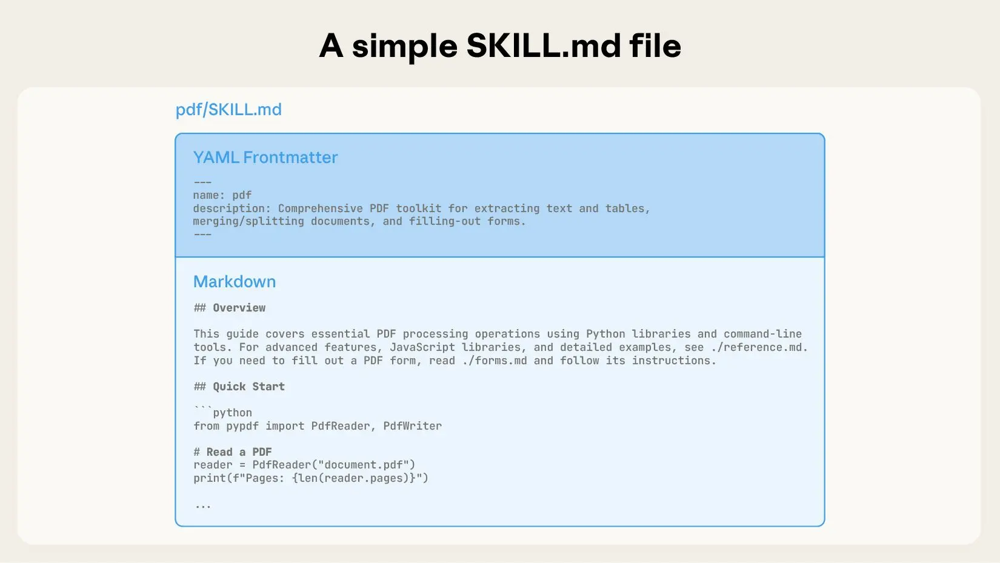

2024 年已经到来，让我们来看看前端开发领域有哪些值得关注的趋势。
<!-- 插入公式 -->

## 1. AI 辅助开发

AI 工具正在改变我们编写代码的方式：

- **GitHub Copilot** 变得更加智能
- **ChatGPT** 可以帮助调试和解释代码
- 各种 AI 代码审查工具涌现

## 2. 边缘计算

边缘函数和边缘渲染正在成为主流：

- Vercel Edge Functions
- Cloudflare Workers
- Deno Deploy

```typescript
export default {
  async fetch(request: Request) {
    return new Response('Hello from the edge!');
  },
};
```

## 3. 服务端组件

React Server Components 正在改变组件架构：

- 减少客户端 JavaScript
- 更好的数据获取模式
- 改善首屏加载时间

## 4. 构建工具革新

新一代构建工具带来更快的开发体验：

- **Vite** 成为新标准
- **Turbopack** 备受期待
- **esbuild** 和 **swc** 底层革新

## 5. CSS 新特性

CSS 正在变得越来越强大：

- Container Queries
- CSS Nesting (原生支持)
- View Transitions API

```css
.card {
  container-type: inline-size;
  
  & .title {
    font-size: 1.5rem;
    
    @container (min-width: 400px) {
      font-size: 2rem;
    }
  }
}
```

## 总结

2024 年的前端开发将更加注重：

1. 性能优化
2. 开发者体验
3. AI 集成
4. 边缘优先架构



保持学习，跟上技术发展的脚步！
